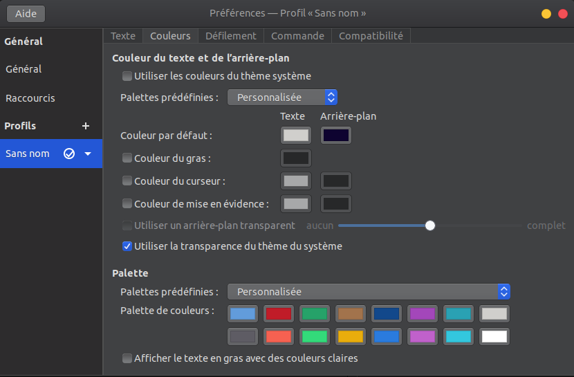

# Installation poste ubuntu2204 sous gnome

## Installation Ubuntu

### Backup

- Faire une sauvegarde de toutes les données importantes du poste sur un disque externe

### Création d'une clé USB bootable

- Télécharger le lien de l'iso [ici](https://ubuntu.com/download/desktop)
- Télécharger [rufus](https://rufus.ie/fr/), et créer une clé usb bootable à partir de l'iso 

### Partitionnement

- Choisir le type d'installation manuel pour pouvoir effectuer le partiionnement du disque

- Supprimer toutes les partitions du disque

- Créer les 3 partitions suivantes sur le disque : 
    - **SWAP** : équivalent à la RAM du pc
    - **EFI** : 1Go
    - **/** : en ext4 le reste de l'espace du disque

## Intallation des softs

### git et conf ssh github

#### Installation et configuration de git

```shell
sudo apt install wget git
git config --global user.name "Mathieu Besson"
git config --global user.email contact@mathieu-besson.fr
```

#### Configuration SSH github

- Génération de la clé si besoin
```shell
ssh-keygen -t rsa
cat ~/.ssh/id_rsa.pub
```

- [Ajout de la clé SSH à un compte github](https://docs.github.com/en/authentication/connecting-to-github-with-ssh/adding-a-new-ssh-key-to-your-github-account)

#### Configuration des dossiers de `/home/user` 

- Supprimer ou renommer les dossiers initiaux

- Renommer les dossiers par défaut de l'user dans `~/.config/user-dirs.dirs`:
```shell
XDG_DESKTOP_DIR="$HOME/desktop"
XDG_DOWNLOAD_DIR="$HOME/downloads"
XDG_TEMPLATES_DIR="$HOME/templates"
XDG_PUBLICSHARE_DIR="$HOME/public"
XDG_DOCUMENTS_DIR="$HOME/doc"
XDG_MUSIC_DIR="$HOME/music"
XDG_PICTURES_DIR="$HOME/images"
XDG_VIDEOS_DIR="$HOME/video"
```

- Redémarrer la session

- Modifier le dossier de téléchargement de firefox : Paramètres > Générale > Fichier et Application > Téléchargement

### Shell custom

#### Installation de ZSH et ohmyzsh

- Suivre la doc d'installation : [ZSH et OhMyZSH](https://doc.mathieu-besson.fr/docs/shell/oh-my-zsh-installation)

#### Changer les couleurs du `gnome-terminal`



### Gestionnaire ajustement interface

- Installation de `gnome-tweaks` et outils liés
```bash
sudo apt install chrome-gnome-shell gnome-shell-extension-prefs gnome-tweaks
```

- Installation de l'extension firefox [`Gnome Extension`](https://addons.mozilla.org/fr/firefox/addon/gnome-shell-integration/) pour gnome

- Sur [extensions.gnome.org](https://extensions.gnome.org), installation des extensions suivantes : 
    - [Simple monitor](https://extensions.gnome.org/extension/3891/simple-monitor/)
    - [Lock screen background](https://extensions.gnome.org/extension/1476/unlock-dialog-background/)
    - [Dash to dock](https://extensions.gnome.org/extension/307/dash-to-dock/)
    - AppIndicator

- Règlage du dock aussi disponible par l'application `Extension`
```shell
gsettings set org.gnome.shell.extensions.dash-to-dock extend-height false
gsettings set org.gnome.shell.extensions.dash-to-dock dock-position BOTTOM
gsettings set org.gnome.shell.extensions.dash-to-dock background-opacity 0
gsettings set org.gnome.shell.extensions.dash-to-dock unity-backlit-items true
gsettings set org.gnome.shell.extensions.dash-to-dock dash-max-icon-size 55
```

## Mise en place du thème `macOS Catalina`

- Télécharger et décompresser le thème [Mc-OS-CTLina-Gnome-Dark](https://www.gnome-look.org/p/1241688/)

- Déplacer le dossier dans `/usr/share/themes/`

```shell
sudo cp -r {theme-name} /usr/share/themes/{theme-name}
```

- Dans l'application `Ajustements` (gnome-tweek) > Apparence > Thèmes > Application : Choisir le thème

## Mise en place du set d'icones `Tela-icon-theme`

- Télécharger et décompresser le thème [01-Tela](https://www.gnome-look.org/p/1279924/)

- Déplacer le dossier dans `/usr/share/icons/`

```shell
sudo cp -r {icon-set-name}/Tela /usr/share/icons/{icon-set-name}
```

- Dans l'application `Ajustements` (gnome-tweek) > `Apparence` > `Thèmes` > `Icônes` : Choisir le set d'icons

## Wallpapers et profil picture

- Télécharger les wallpapers et profil picture disponibles [ici](https://github.com/MathieuBesson/doc.mathieu-besson.fr/tree/main/docs/installation-soft/assets/wallpapers) dans le dossier `~/images/`
- Choisir les wallpapers à utiliser dans `Ajustements` (gnome-tweek) > `Apparence` > `Arrière-plan & Écran de vérouillage` > `Image : Choisir le wallpaper`
- Choisir la PP dans `Paramètres` > Utilisateurs

## Installation et configuration des softs

- Codecs vidéos 
```shell
sudo apt-get install ubuntu-restricted-extras
```

- VirtualBox
```shell
sudo apt-get install virtualbox
```

- Installation de Vagrant
```shell
sudo apt-get install vagrant
```

- Installation de make
```shell
sudo apt-get -y install make
```

- Pavucontrol
```shell
sudo apt-get -y install pavucontrol
```

- Discord
```shell
sudo snap install discord
```

- Spotify
```shell
sudo snap install spotify
```

- Teams
```shell
sudo snap install teams-for-linux
```

- VsCode
```shell
sudo snap install --classic code 
```

- VLC
```shell
sudo snap install vlc
```

- ElectronPlayer
```shell
sudo snap install electronplayer
```

- Flameshot 
```shell
sudo apt-get -y install flameshot
```

- [Docker](https://doc.mathieu-besson.fr/docs/docker/docker-installation)


## TODO : Manquant

- Ajouter un gestionnaire de tilling + configuration
- Raccourcis

## Lien utiles

- [SSH Github](https://docs.github.com/en/authentication/connecting-to-github-with-ssh)
- [OhMyZSH](https://www.freecodecamp.org/news/jazz-up-your-zsh-terminal-in-seven-steps-a-visual-guide-e81a8fd59a38/)