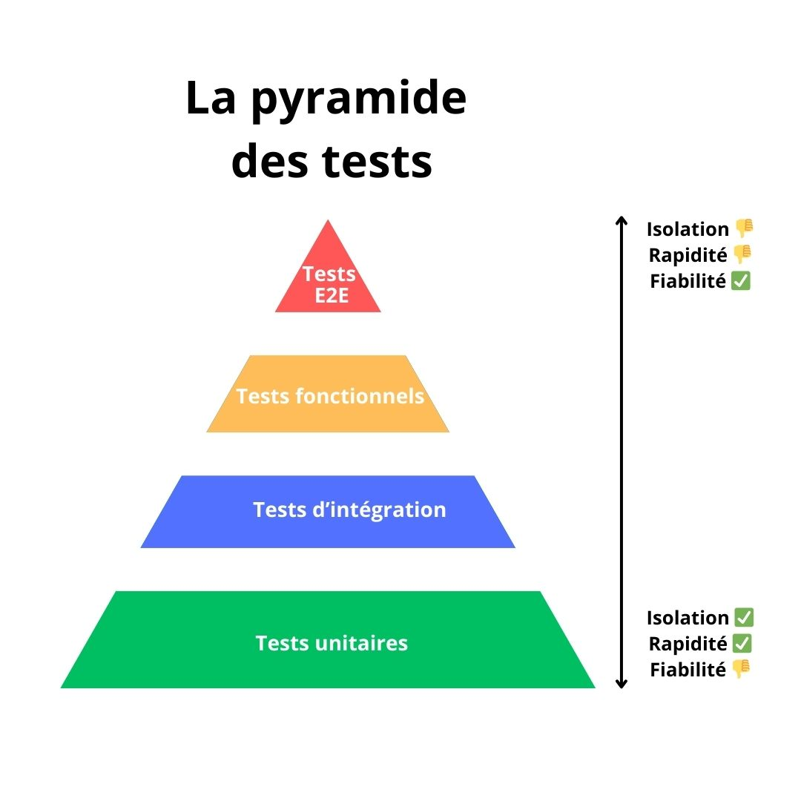

# Les tests ? késako ? 

En développement informatique, les **tests** sont des moyens efficaces permettant de vérifier qu'un script ou une application fonctionne comme initialement prévue. L'utilisation de tests permet d'éviter d'introduire des régréssions à la modification du code source et d'éviter les bugs ou comportements innatendus. 

!!! warning "Note importante"

    Les exemples ci-dessous sont écrit en pseudo-code et ont pour objectif de mieux comprendre le déroulé et objectifs des différents types de tests présentés. Le mot clé `assert` induit une vérification entre la valeur attendue et la valeur retournée par le script. 
    
    Dans une véritable application PHP, il est recommandé d'utiliser des frameworks de tests comme [PHPUnit](https://phpunit.de) (**tests unitaire**, **tests d'intégration** et **tests fonctionnelles**) et [Panther](https://github.com/symfony/panther) (ou [Cypress](https://www.cypress.io/)) (**tests end-to-end**)

## Les différents types de tests

Il existe plusieurs types de tests pour vérifier le bon fonctionnement d'un logiciel. Les sections ci-dessous présentent quelques types de tests courants.



### Tests Unitaires (TU)

Les **tests unitaires** sont les tests les plus basiques. L'objectif est de vérifier le bon fonctionnement d'unités de code (fonctions ou méthodes) de manière individuel et isolée.

#### Caractéristiques

- **Objectif** : Vérifier le bon fonctionnement de chaque unité de code, indépendamment des autres parties du système.
- **Portée** : Très limitée, test de chaque unité de code indépendemment.
- **Simplicité** : Rapides à exécuter et facilement automatisable.

#### Exemple

**Cas de test** : Test d'une fonction qui additionne deux nombres. Le test unitaire vérifiera que la fonction retourne le bon résultat pour différentes combinaisons d'entrées.

```python
test_unit "Test add function" :
    assert add(2, 3) == 5
    assert add(-1, 1) == 0
    assert add(0, 0) == 0
```

### Tests d'Intégration (TI)

Les **tests d'intégration** permettent de vérifier que plusieurs modules ou composants fonctionnent ensemble comme prévu. Il ne s'agit plus du test d'une unité isolé (TU) mais bien du test de la combinaison des différents modules.

#### Caractéristiques

- **Objectif** : Tester l'interaction entre plusieurs modules/parties du logiciel.
- **Portée** : Plus large que les TU, car ils impliquent plusieurs modules.
- **Niveau de complexité** : Plus complexes à écrire que les TU, car ils nécessitent de configurer plusieurs composants et leurs interactions.

#### Exemple

**Cas de test** : Test de la persistence d'un user dans une base de donnée.

```python
test_integration "Test user creation in database" :

    # Étape 1 : Initialisation de la BDD et récupération du helper à tester
    database = initialize_database()
    user_service = initialize_user_service(database)

    # Étape 2 : Création du user grace au service
    user_data = {
        "name": "Pierre",
        "email": "pierre@dupond.com"
    }
    user_service.create_user(user_data)

    # Étape 3 : Récupération du user dans la base de donnée pour vérifier l'insertion
    user_db = database.query("SELECT * FROM users WHERE email = 'pierre@dupond.com'")

    # Étape 4 : Vérification des données récupérées
    assert user_db.name == "Pierre"
    assert user_db.email == "pierre@dupond.com"
```

### Tests Fonctionnels (TF)

Les **tests fonctionnels** vérifient que les fonctionnalités d'une application respectent les spécifications fonctionnelles définies. Les tests fonctionnelles s'assurent que l'application répond aux exigences fonctionnelles de l'utilisateur.

#### Caractéristiques

- **Objectif** : Les fonctionnalités testés de l'application correspondent aux pécifications fonctionnelles.
- **Portée** : Couvre des fonctionnalités complètes.
- **Complexité** : Simples à concevoir si l'on se base sur les spécifications, mais peuvent devenir complexes en fonction de la fonctionnalité testée.

#### Exemple

**Cas de test** : Test de la soumission d'un nouveau commentaire sur la page d'un article

```python
test_functional "Test comment submission and redirection" :

    # Étape 1 : Récupration de laa page de l'article
    article_page = get_article_page(123) 

    # Étape 2 : Création d'un commentaire
    comment_form = article_page.get_comment_form()
    comment_form.fill("username", "Pierre Dupond")
    comment_form.fill("comment", "Top l'article !")
    
    # Étape 3 : Soumission du formulaire
    result_page = comment_form.submit()

    # Étape 5 : Récupération du dernier commentaire posté et vérifications
    last_comment = result_page.get_comments().get_last_comment()
    assert last_comment.username == "Pierre Dupond"
    assert last_comment.text == "Top l'article !"
```

### Tests End-to-End (E2E)

Les **tests end-to-end** (ou **tests de bout en bout**) simulent des scénarios d'utilisation complets de l'application, comme un utilisateur final qui se connecte, navigue et éffectue des actions sur une application. Ils vérifient que toutes les parties du système (front-end, back-end, base de données, etc.) fonctionnent ensemble correctement, dans l'environnement réel ou proche de la production.

#### Caractéristiques

- **Objectif** : Tester que toutes les fonctionnalités du système fonctionnent comme prévu, de bout en bout, dans un contexte réaliste.
- **Portée** : Très large, couverture complète de l'application.
- **Complexité** : Difficile à mettre en place et à maintenir à cause des nombreuses interactions à gérer (bases de données, API, interfaces utilisateur, etc.).

#### Exemple

**Cas de test** : L'utilisateur se connecte à l'application, navigue vers une page d'annonce d'emploi et soumet sa candidature via un formulaire.

```python
test_e2e "Test login, job posting navigation, and job application" :

    # Étape 1 : Connexion
    browser = open_browser()
    login_page = browser.go_to("/login")
    login_page.fill("email", "john.doe@example.com")
    login_page.fill("password", "password123")
    dashboard_page = login_page.submit()
    assert dashboard_page.url == "/dashboard"

    # Étape 2 : Accès à la page des annonces
    jobs_page = dashboard_page.go_to("/jobs")
    assert jobs_page.has_job_posting("Développeur PHP")

    # Étape 3 : Postuler à l'offre
    job_detail_page = jobs_page.click_on_job("Développeur PHP")
    apply_form = job_detail_page.get_apply_form()
    apply_form.fill("full_name", "John Doe")
    apply_form.fill("email", "john.doe@example.com")
    apply_form.submit()

    # Étape 4 : Vérifier la soumission
    confirmation_page = job_detail_page.get_confirmation_page()
    assert confirmation_page.get_success_message() == "Candidature soumise avec succès."
    
    # Fermer le navigateur
    browser.close()
```

## Conclusion

Chaque type de test a son objectif dans le développement logiciel :

- Les **tests unitaires (TU)** vérifient la fiabilité des plus petites unités de code.
- Les **tests d'intégration (TI)** vérifient l'intégration entre les différents modules.
- Les **tests fonctionels (TF)** vérifient une fonctionnalité dans son ensemble.
- Les **tests end-to-end (E2E)** vérifient le bon comportement de l'application du point de vue de l'utilisateur final.

Ces tests, lorsqu'ils sont combinés, garantissent la fiabilité et la stabilité d'un logiciel.


## La suite ? 🚀

- [Les tests unitaires en PHP](./01-tests-unitaire-php.md)
- [Les tests d'intégration avec Symfony](./tests-symfony/01-tests-integration-symfony.md)